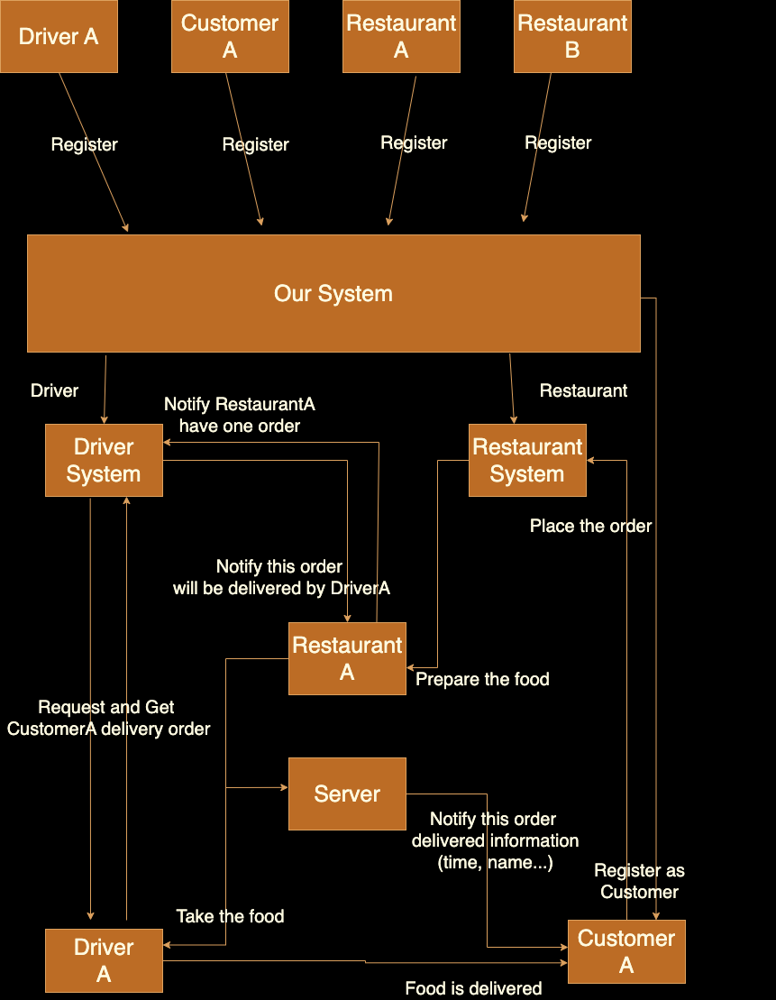

# OrderFlowManager
Some GIF or pictures at here.

## Introduction
This project is a simple Task Manager API built using Node.js, Express, and MongoDB with Mongoose. It allows users to create, read, update, and delete tasks. Tasks have attributes like title, description, due date, priority, and completion status.

<div align=“center”>
    
</div>


## Features
- Basic RESTful API demonstration
- Unit testing demonstration
- Modular structure

## Quick Start

1. Install the libraries (`dotenv, express, mongoose, nodemon, jest, supertest, bcrypt`):
    ```bash
    npm install dotenv express mongoose nodemon jest supertest bcrypt
    ```

2. Set up environment variables:
   - Create a `.env` file in the project root.
   - Add the following environment variables:
     ```
     DB_USER=yourMongoDBUsername
     DB_PASSWORD=yourMongoDBPassword
     DB_NAME=yourMongoDBClusterName
     DB_USE=yourDatabaseName
     DB_DEFAULT_PORT=3005
     ```

3. Make sure MongoDB is running (either locally or via MongoDB Atlas).

4.  Running the Project. Make sure can run the server and unit testing:
    ```bash
    cd server
    npm test
    crtl+C
    npm start
    ```

5. The server will run at `http://localhost:3005`. You can use a tool like Postman to interact with the API.

## API Endpoints
Check more API detail at ./API_DOCS
### 1. **GET /XXXXX**

YYYYYYYY

- **URL**: `/restaurant/XXXXX`
- **Method**: `GET`
- **Response**:
    - Status: `200`
    - Body: An array of tasks in JSON format.
```json
[
  {
    "_id": "64f5a88f1c4d882ebd64b8b1",
    "Name": "Sample menu",
    "Description": "Description for the menu",
    "Date": "2024-10-03T00:00:00.000Z",
  }
]
```

## Folder Structure

```
└── OrderFlowManager/ #(Develop Order: Model -> Controller -> Routes -> app)
    ├── API_Docs     
    ├── config          # Config Setting
    ├── controller      # Responsible for handling user input and application logic.
    │   ├── core
    │   ├── driver
    │   ├── order
    │   └── restaurant
    ├── model       # The collections of MongoDB
    │   ├── core
    │   ├── driver
    │   ├── order
    │   └── restaurant
    ├── public      # Local Image
    │   ├── core
    │   ├── driver
    │   ├── order
    │   └── restaurant
    ├── routes   
    │   ├── core
    │   ├── driver
    │   ├── order
    │   └── restaurant
    ├── tests       # Unit Testing File
    │   ├── core
    │   ├── driver
    │   ├── order
    │   └── restaurant
    ├── view        # UI
    │   ├── core
    │   ├── driver
    │   ├── order
    │   └── restaurant  
    ├── App.js          # Main
    └── package.json
```
