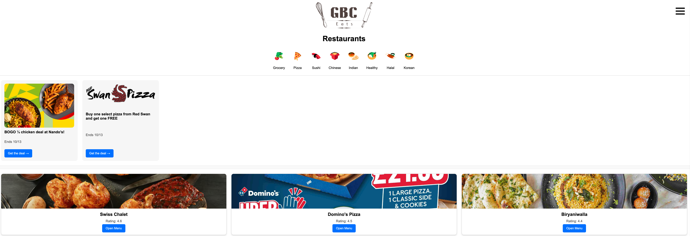
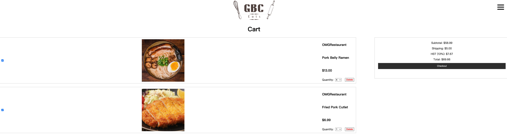
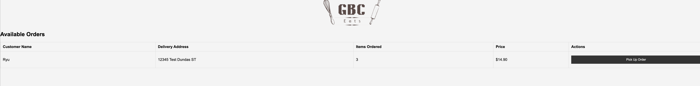
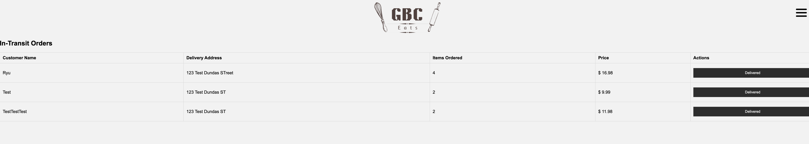

# Food Ordering System
## Introduction
This project aims to simulate the commercial application of Uber Eats and mobile ordering for dine-in service. 
This project uses React.js, Node.js, Express, EJS, and MongoDB with Mongoose.

- Food Delivery (Path: ./server): 
Simulating the operational model of Uber's commercial application, we have built a restaurant and an ordering website similar to Uber Eats. We simulate the entire process of delivering food, from placing orders on a delivery platform to having the delivery personnel bring the meals to customers.
- Dine-in Ordering (Path: ./Indoor_Ordering): 
When customers arrive at the restaurant, they can use their phones to scan the QR code corresponding to their table and place an order. Once the order is placed, the data is sent to MongoDB, where it presents the corresponding order, table number, and meals to the kitchen for preparation.


## Features
- Basic RESTful API demonstration
- Restaurant: One-page website, menu page, and add menu page
<div align="center">
    
</div>
- Ordering systen: (login & registration, cart & checkout, order status)
<div align="center">
    
</div>
<div align="center">
    
</div>
<div align="center">
    
</div>
<div align="center">
    
</div>
- Dine-in systen: 

## Workflow
<div align="center">
    
</div>

## Quick Start

1. Install the libraries (`dotenv, express, mongoose, nodemon, jest, supertest, bcrypt, jsonwebtoken, ejs, cookie-parser, multer`):
    ```bash
    npm install dotenv express mongoose nodemon jest supertest bcrypt jsonwebtoken ejs cookie-parser multer
    ```

2. Set up environment variables:
   - Create a `.env` file in the project root. Check `Folder Structure` topic at bottom.
   - Add the following environment variables:
     ```
     DB_USER=yourMongoDBUsername
     DB_PASSWORD=yourMongoDBPassword
     DB_NAME=yourMongoDBClusterName
     DB_USE=yourDatabaseName
     DB_DEFAULT_PORT=3005
     LOGGING_JWT_SECRET=YourSecretKey
     DB_ACCOUNT_PREFIX=/account
     DB_RESTAURANT_PREFIX=/restaurant
     DB_ORDER_PREFIX=/order
     DB_DRIVER_PREFIX=/driver
     GOOGLE_MAP_KEY=Your_Google_MAP_KEY
     ```

3. Make sure MongoDB is running (either locally or via MongoDB Atlas).

4.  Running the Project. Make sure can run the server and unit testing:
    ```bash
    cd server
    npm test
    crtl+C
    npm start
    ```

5. The server will run at `http://localhost:3005`. You can use a tool like `Postman` to interact with the API.
- Account: /account/register
- Restaurant: /restaurant/home
- Order: /order/OrderHome

6. Register your account. There is sample at below.
```
UserName: "TestTestTest"
Password: "Test@123"
Email: "Test@GBCEats.com"
Phone: "437-123-4567"
Address: "123 Dundas St, Toronto, ON"
```

7. Enjoy!


## API Endpoints
Check more API detail at `./API_DOCS`
#### 1. **POST: /account/login**
Login router

- **URL**: `/account/login`
- **Method**: `POST`
- **Response**:
    - Status: `200`
    - Body: An array of tasks in JSON format.
```json
[
  {
    "username": "TestTestTest",
    "password": "Test@123", 
}
]
```

## Database Schema
Using `MongoDB` for building collections. Check more database schema detail at `./API_DOCS`

```sql
Table	"FatherField"	Field	    "ChildField"	DataType	Required	Default	 Remark
Cart	                AccountID	            	ObjectId    TRUE                 Account._id
Cart	 Items	        MenuID		                ObjectId    TRUE                 Menu._id
Cart	 Items	        Quantity                    Number      TRUE		            
Cart                    UpdateAt                    Date        TRUE        new Date()	
```

## Folder Structure
The basic structure in our project.
```
├── Indoor_Ordering/  # (Not Start Yet) Focusing on the in-house dining. It can also use in take-out situation.
└── OrderFlowManager/ #(Develop Order: Model -> Controller -> Routes -> app)
    ├── API_Docs     # API Router and Database Schema
    ├── config          # Config Setting
    ├── component       # UI element
    │   ├── core
    │   ├── driver
    │   ├── order
    │   └── restaurant
    ├── controller      # Responsible for handling user input and application logic.
    │   ├── core
    │   ├── driver
    │   ├── order
    │   └── restaurant
    ├── model       # The collections of MongoDB
    │   ├── core
    │   ├── driver
    │   ├── order
    │   └── restaurant
    ├── public      # Local Image
    │   ├── core
    │   ├── driver
    │   ├── order
    │   ├── restaurant
    │   └── style
    │       ├──  ......css
    │       └──  App.css    # Global CSS
    ├── routes   
    │   ├── core
    │   ├── driver
    │   ├── order
    │   └── restaurant
    ├── tests       # Unit Testing File
    │   ├── core
    │   ├── driver
    │   ├── order
    │   └── restaurant
    ├── utils       #  Useful Function(Verify Token, Calculation, String Split.....)
    │   ├── core
    │   ├── driver
    │   ├── order
    │   └── restaurant
    ├── views        # UI
    │   ├── core
    │   ├── driver
    │   ├── order
    │   └── restaurant  
    ├── .env            # Environment Parameter
    ├── App.js          # Main
    └── package.json
```

